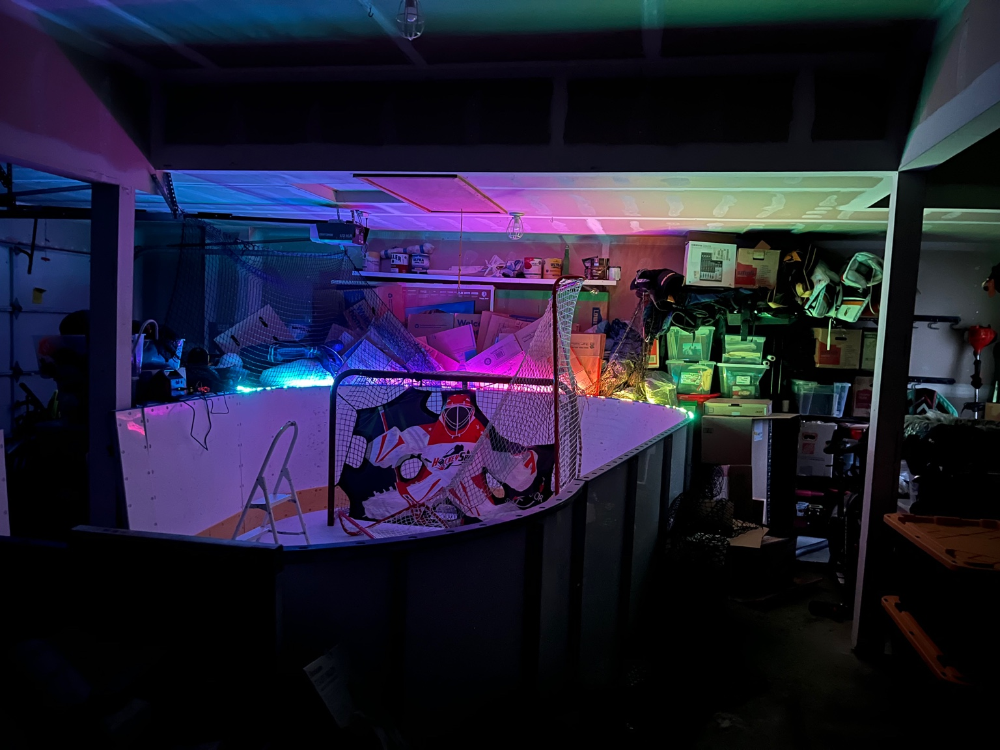
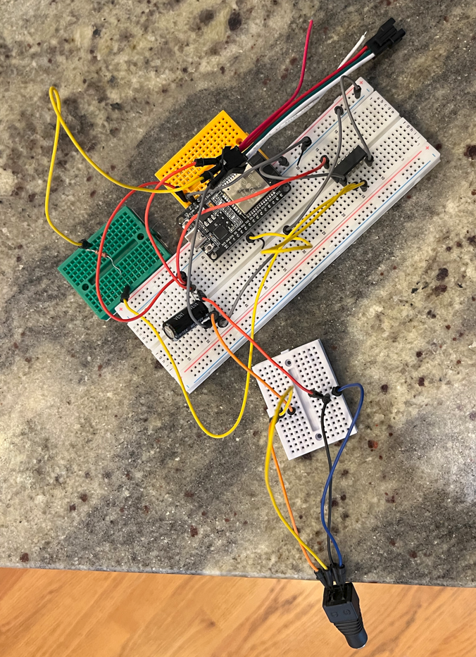

# ESP32 IoT LED Animation Engine

An RTOS-based IoT controller for WS2812B LED strips featuring a real-time web dashboard and custom animation logic. This was my first project working with embedded systems and hardware. I worked with the **ESP-IDF** (Espressif IoT Development Framework) in C.

---

## The Motivation
This project was designed to support my brother’s New Year’s resolution: spending 30 minutes daily in his garage hockey training setup. I engineered this IoT controller to turn a standard garage into a high-energy good-vibes training environment. The goal was to help turn the garage into a spot where my brother could bring over friends, train together, and switch between difference LED color patterns as they wanted.

---

## Project Showcase

### **IoT LED Rink Video (Click on Photo)**
<a href="https://youtu.be/VQddDjZLYws">
  
</a>

### **The Hardware**


---

## Key Features
* **Full-Stack Control:** Mobile-responsive web dashboard hosted directly on the ESP32 to handle real-time mode switching.
* **Hardware-Level Precision:** Leveraged the **RMT (Remote Control) peripheral** to achieve nanosecond-level timing for a 300-LED array.
* **Animation Engine:** Custom C implementations for Rainbow Chase, Waterloo Chase, Fire Effect, Christmas, Happy New Year, and others.
* **Multitasking Architecture:** Utilized **FreeRTOS** to handle concurrent networking and hardware-intensive animations without blocking the system.

---

## Hardware Setup

This setup features a **15A high-amperage power configuration** and signal translation logic to reliably drive a LED strip (300).


### **Core Components**
* **Microcontroller:** **ELEGOO ESP-32 Development Board** featuring a dual-core 32-bit processor.
* **LED Strip:** **BTF-LIGHTING WS2812B RGB ECO** (16.4FT, 300 Pixels).
* **Power Supply:** **JOVNO 5V 15A AC Adapter** to provide 75W of power and prevent voltage drops across the long strip.
* **Prototyping:** **BOJACK Solderless Breadboard** with flexible jumper wires.

### **Signal & Power Integrity** 
* **Logic Level Shifter (74AHCT125):** Translates the ESP32's 3.3V signal to the 5V signal the LEDs require.
* **Power Reservoir (1000µF 25V Capacitor):** Acts as a buffer to protect the LEDs from initial power spikes.
* **Data Protection (330 Ohm Resistor):** Installed on the data line to protect the ESP32's GPIO pins.
* **DC Adapter:** 2.5mm Female DC Barrel to Screw Terminal to match the high-amperage power supply.

---

## Insights:

* **Common Ground Logic:** Established a "Common Ground" by connecting the GND of the power supply to the GND of the ESP32, ensuring a shared reference point for the data signal.
* **The "Translator" (Encoder Logic):** WS2812B LEDs require strict timing where a "0" is a short pulse and a "1" is a long pulse. I used an **RMT-based encoder** to translate 8-bit color data into these timing symbols.
* **Memory Optimization:** To maximize performance, large constant strings (like the HTML dashboard) are stored in **Flash Memory** (the instruction bus) rather than the limited **Stack**.
* **Multitasking Logic:** Implemented a background **Web Server task** to listen for user input. When a mode is selected, it updates a global state variable (`led_mode`) that the **Main LED task** reads to render animations.


---

## How to Run

1. **Clone the repo:** `git clone https://github.com/Mr-Methodical/ESP32-IoT-LED-Controller`
2. **Add Credentials:** Create a `main/secrets.h` with your Wi-Fi SSID and Password.
3. **Build & Flash:**
   ```bash
   idf.py build 
   idf.py -p [PORT] flash monitor 